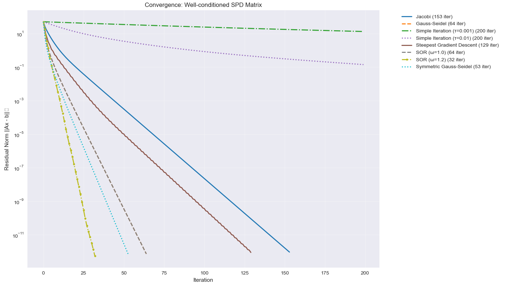
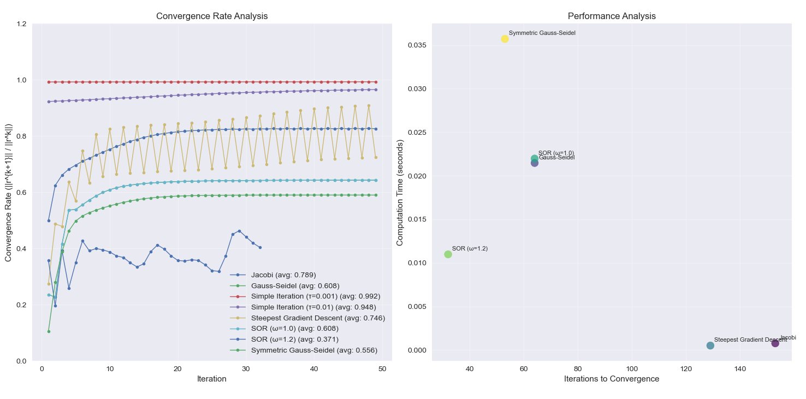
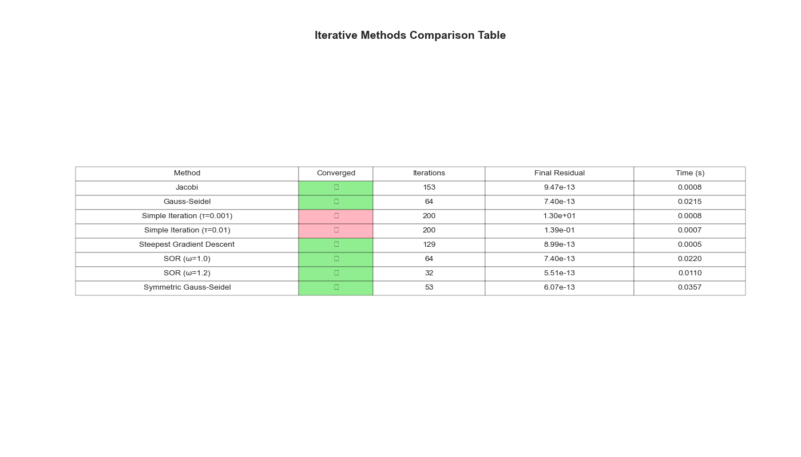

# Iterative Methods for Linear Systems

## Overview

A Python implementation of various iterative methods for solving linear systems Ax = b. This project demonstrates the convergence properties and performance characteristics of different iterative algorithms

## Features

- **Multiple Iterative Methods**: Implementation of 8 different iterative algorithms
- **Convergence Analysis**: Real-time tracking of residual norms and convergence rates
- **Performance Comparison**: Side-by-side comparison of method efficiency and accuracy
- **Matrix Property Analysis**: Automatic detection of matrix characteristics affecting convergence
- **Visualization Tools**: Comprehensive plotting for convergence behavior and performance metrics
- **Robust Error Handling**: Warnings for potential convergence issues and method limitations

## Project Structure

```t
Iterative-Methods/
├── iterative_methods.py      # Core solver class with all iterative methods
├── convergence_comparison.py # Analysis and visualization tools
├── graphs/                   # Generated plots and visualizations
│   ├── Convergence-rate-well-considered-matrice.png
│   ├── Iterative-methods-comparasion-table.png
│   └── Convergance-well-considered-matrice.png
└── README.md
```

## Implemented Methods

### 1. Jacobi Method

```python
x^{k+1}_i = (b_i - Σ_{j≠i} A_{ij}x^k_j) / A_{ii}
```

**Matrix Form**: `x^{k+1} = D^{-1}(b - (L + U)x^k)`

### 2. Gauss-Seidel Method

```python  
x^{k+1}_i = (b_i - Σ_{j<i} A_{ij}x^{k+1}_j - Σ_{j>i} A_{ij}x^k_j) / A_{ii}
```

**Matrix Form**: `(D + L)x^{k+1} = b - Ux^k`

### 3. Simple Iteration Method

```python

x^{k+1} = x^k - τ(Ax^k - b)
```

**Features**: Configurable step size parameter τ

### 4. Steepest Gradient Descent

```python
x^{k+1} = x^k - τ_k r^k, where τ_k = ||r^k||^2 / (r^k)^T A r^k
```

**Features**: Optimal step size computation for quadratic minimization

### 5. Successive Over-Relaxation (SOR)

```python
x^{k+1}_i = (1-ω)x^k_i + ω/A_{ii}[b_i - Σ_{j<i} A_{ij}x^{k+1}_j - Σ_{j>i} A_{ij}x^k_j]
```

**Features**: Configurable relaxation parameter ω

### 6. Symmetric Gauss-Seidel

**Features**: Forward and backward sweeps for improved convergence on symmetric matrices

## Usage Examples

### Basic Usage

```python path=null start=null
from iterative_methods import IterativeMethodsSolver, create_test_system
import numpy as np

# Create a test system
A, b, x_true = create_test_system(n=100, condition_number=50)

# Initialize solver
solver = IterativeMethodsSolver(A, b, tolerance=1e-10, max_iterations=1000)

# Solve using different methods
x_jacobi, residuals_jacobi, iterations = solver.jacobi_method()
x_gs, residuals_gs, iterations = solver.gauss_seidel_method()
x_sgd, residuals_sgd, iterations = solver.steepest_gradient_descent()
```

### Comprehensive Analysis

```python path=null start=null
from convergence_comparison import compare_methods, plot_convergence_comparison

# Generate test matrix
A, b, x_true = create_test_system(n=50, condition_number=10)

# Compare all methods
results = compare_methods(A, b, x_true, tolerance=1e-12, max_iterations=200)

# Visualize results
plot_convergence_comparison(results, "Method Comparison")
```

## Algorithm Implementation Details

### Convergence Criteria

All methods use the residual norm as convergence criterion:

```python
||Ax^k - b||_2 < tolerance
```

### Matrix Property Detection

The solver automatically analyzes:

- **Diagonal Dominance**: Critical for Jacobi/Gauss-Seidel convergence
- **Condition Number**: Indicates numerical stability
- **Symmetry**: Affects method selection and convergence rates
- **Positive Definiteness**: Enables gradient-based methods

### Error Handling

- Automatic detection of zero diagonal elements
- Warnings for matrices lacking diagonal dominance  
- Maximum iteration limits with convergence status reporting
- Robust handling of numerical edge cases

## Visualizations

The project generates three types of analysis plots:

### 1. Convergence Comparison



- Semi-logarithmic plot of residual norms vs iterations
- Comparison of all methods on the same system
- Clear visualization of convergence rates

### 2. Convergence Rate Analysis  



- Analysis of consecutive residual ratios
- Performance vs iteration count scatter plot
- Method efficiency comparison

### 3. Performance Comparison Table



- Comprehensive tabular comparison
- Convergence status, iteration count, final residuals
- Computation time analysis

## Matrix Test System Generation

The `create_test_system()` function generates controlled test cases:

```python path=null start=null
def create_test_system(n: int = 100, condition_number: float = 100):
    """
    Creates symmetric positive definite test matrices with:
    - Specified condition number for controlled difficulty
    - Known analytical solution for error analysis
    - Realistic numerical properties
    """
```

## Requirements

- **Python 3.7+**
- **NumPy**: Matrix operations and linear algebra
- **Matplotlib**: Visualization and plotting
- **Warnings**: Method stability notifications

## Usage

```bash
python3 convergence_comparison.py
```
